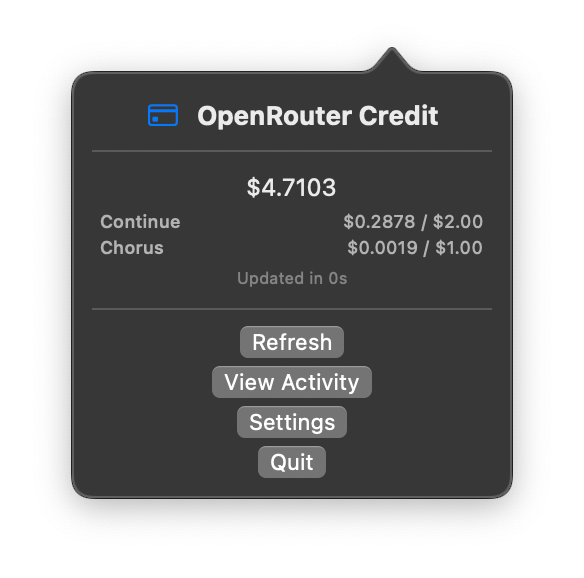
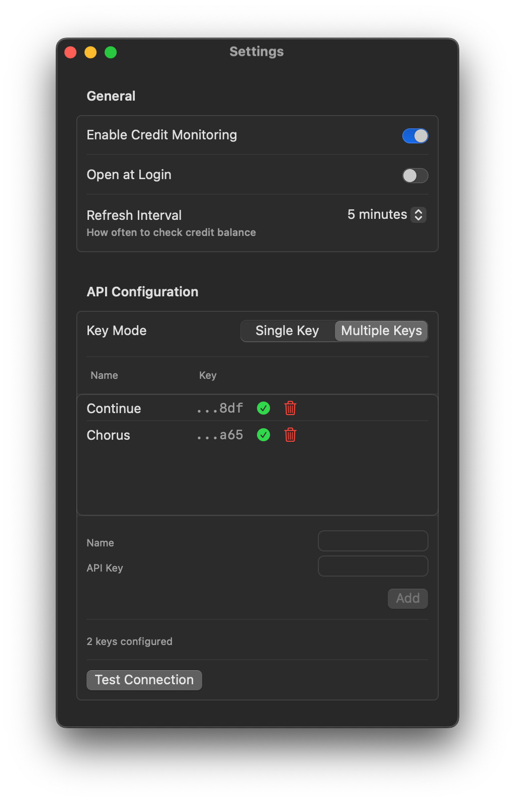

# OpenRouter Credit MenuBar

A professional macOS menu bar application for monitoring OpenRouter API credits with comprehensive connection testing.

## Features

- **Real-time Credit Monitoring**: Display your OpenRouter credit balance directly in the menu bar
- **Comprehensive Connection Testing**: Test multiple API endpoints with detailed progress reporting
- **Automatic Refresh**: Configurable refresh intervals (30 seconds to 1 hour)
- **Enhanced Connection Testing**: Sequential endpoint testing with real-time progress updates
- **Visual Feedback**: Loading indicators, success checkmarks, and error indicators
- **Single Keychain Access**: Optimized API key management with caching
- **Professional Settings Window**: Proper focus management with taller window design
- **Launch at Login**: Optional automatic startup when you log in
- **Secure Configuration**: Encrypted API key storage with comprehensive connection testing

## Screenshots

### Menu Bar Display
The app shows your current available credit directly in the menu bar.

### Settings Window
- Toggle credit monitoring on/off
- Set launch at login preferences
- Configure refresh intervals
- Securely enter and test your OpenRouter API key

## Requirements

- macOS 15.4 or later
- OpenRouter API account and API key
- Xcode 16.3 or later (for development)

## Installation

### From Release
1. Download the latest release
2. Extract the .zip file
3. Move the application to your Applications folder
4. Launch the app and grant necessary permissions when prompted

### From Source
1. Clone this repository
2. Open `OpenRouterCreditMenuBar.xcodeproj` in Xcode
3. Build and run the project (⌘+R)

## Setup & Configuration

1. **Get Your API Key**:
   - Visit OpenRouter and create an account
   - Navigate to your API keys section
   - Generate a new API key

2. **Configure the App**:
   - Launch OpenRouterCreditMenuBar
   - Click the menu bar icon and select "Settings"
   - Enter your OpenRouter API key in the "API Configuration" section
   - Click "Test Connection" to verify your API key works
   - Adjust refresh interval as needed (default: 30 seconds)
   - Optionally enable "Open at Login" for automatic startup

3. **Start Monitoring**:
   - Enable "Credit Monitoring" in settings
   - Your credit balance will appear in the menu bar
   - Click "Refresh" anytime to update manually

## Usage

- **View Credits**: Click the menu bar icon to see your current available credit
- **Refresh**: Use the "Refresh" button to manually update your balance
- **Test Connection**: Verify API connectivity with comprehensive endpoint testing
- **Settings**: Access configuration options through the Settings button
- **View Activity**: Open OpenRouter activity page directly from the menu
- **Quit**: Close the application using the Quit button

### Connection Testing

The connection testing feature allows you to:
- Test multiple OpenRouter API endpoints sequentially
- See real-time progress updates for each test
- Receive comprehensive success/failure feedback
- Get specific error messages with recovery suggestions
- Verify your API key and server connectivity

## Development

This project is built with:
- **Language**: Swift
- **Platform**: macOS 15.4+
- **IDE**: Xcode 16.3+
- **Architecture**: Native macOS menu bar application

### Building from Source

1. Clone the repository
2. Open `OpenRouterCreditMenuBar.xcodeproj` in Xcode
3. Configure signing & capabilities if needed
4. Build using ⌘+B or run with ⌘+R

### Project Structure

- Menu bar integration with real-time updates
- Secure keychain storage for API credentials
- Native macOS UI with dark mode support
- Sandboxed application architecture

## Security & Permissions

This app requires the following permissions:
- **Network Access**: To communicate with OpenRouter's API endpoints
- **Keychain Access**: To securely store your API key (optional)
- **Launch Agent**: To start automatically at login (if enabled)

The application runs in a sandboxed environment for enhanced security.

## Privacy

- Your API key is stored locally and never transmitted except to OpenRouter's official API
- No usage data or personal information is collected
- All network requests go directly to OpenRouter's servers

## Contributing

Contributions are welcome!

1. Fork the repository
2. Create your feature branch (`git checkout -b feature/amazing-feature`)
3. Commit your changes (`git commit -m 'Add some amazing feature'`)
4. Push to the branch (`git push origin feature/amazing-feature`)
5. Open a Pull Request

## License

MIT License

## Support

If you encounter any issues or have questions:
- Check the documentation
- Review the setup instructions

## Current Status

✅ **All Core Features Implemented**:
- Real-time credit monitoring with menu bar display
- Comprehensive connection testing with multiple endpoints
- Secure API key management with single keychain access
- Professional settings window with proper focus management
- Enhanced user experience with visual feedback

## Future Enhancements

Potential future features:
- Credit usage history and analytics
- Multiple account support
- Custom notification thresholds
- Export credit usage data
- Token usage tracking integration

---

## 🤝 Inspiration & Attribution

This application builds upon the foundation established by the [OpenRouterCreditMenuBar](https://github.com/kittizz/OpenRouterCreditMenuBar) project. The current implementation maintains the core concept of monitoring OpenRouter API credits while introducing several improvements:

- **Enhanced Connection Testing**: Multi-endpoint testing with real-time progress updates
- **Professional UI**: Proper focus management and improved window handling
- **Optimized Performance**: Single keychain access with API key caching
- **Comprehensive Feedback**: Visual indicators and clear success/failure messages
- **Improved Error Handling**: User-friendly messages with recovery suggestions

**Note**: This application provides comprehensive OpenRouter API credit monitoring with professional macOS integration and enhanced connection testing capabilities. The implementation represents an evolution of the original concept with improvements focused on user experience and functionality.